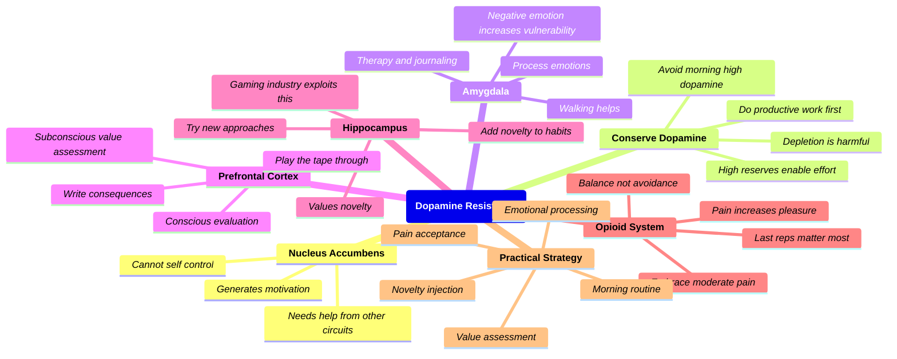

# 🧠 How to Boost Your Resistance to Dopamine

> _An addiction psychiatrist explains the neuroscience of dopamine resistance, covering the **nucleus accumbens**, **amygdala**, **prefrontal cortex**, **hippocampus**, and **opioid circuits**. Practical strategies to regain control over motivation and reduce addiction to high-dopamine activities._

---

> [!summary]- Description
> An addiction psychiatrist explains the neuroscience of dopamine resistance. Covers the **nucleus accumbens**, **amygdala**, **prefrontal cortex**, **hippocampus**, and **opioid circuits**. Practical strategies to regain control over motivation and reduce addiction to high-dopamine activities like _gaming_ and _social media_.

---

## Summary

This video explains why we struggle to control our motivation toward **high-dopamine activities**. The core problem is that the _**nucleus accumbens**_ generates motivation and _**cannot directly control itself**_. Instead of fighting it with _willpower_, the video presents a **neuroscience-based approach** using _other brain circuits_ to weaken the nucleus accumbens' influence.

The key insight is _**counterintuitive**_: **dopamine depletion makes things worse**. Research on rats shows that _dopamine-depleted animals cannot sustain effort_ for low-reward but beneficial activities. The solution is to **conserve dopamine reserves** by _avoiding high-dopamine activities early in the day_, and doing **productive work first** to train the brain to reinforce those behaviors.

Four other brain circuits are leveraged: the **amygdala** (_negative emotions increase vulnerability_ — process them through journaling, therapy, walks), the **prefrontal cortex** (_change subconscious value assessments_ using "play the tape through to the end"), the **hippocampus** (_add novelty_ to make desired activities more motivating), and the **opioid system** (_embrace moderate pain_ to increase pleasure from activities).

---

## Key Takeaways

- **Dopamine is not the enemy.** _High dopamine reserves enable sustained effort on low-reward tasks._ **Depletion makes you more vulnerable** to high-dopamine activities.
- **Avoid high-dopamine activities for the first hour after waking**, _ideally 4 hours_. Do **productive work first** to train brain reinforcement.
- **Negative emotions increase dopamine vulnerability.** _Process emotions_ through therapy, journaling, meditation, or walks.
- _**"Play the tape through to the end"**_ — _consciously write out the consequences_ of your choices over a full day.
- **Novelty triggers motivation** via the hippocampus. _If a habit fails, change the approach radically._
- **Moderate pain increases pleasure** through the opioid system. _The last painful reps provide the strongest reinforcement._
- _**One brain part cannot control itself.**_ Use _other circuits_ to regulate the nucleus accumbens.
- **Conserve dopamine like a bank account.** _Avoid emptying reserves_ on high-dopamine activities first thing.

---

## Mindmap

---

## Notable Quotes

- [0:03: _**"boost your resistance to dopamine"**_]([Unknown])
- [0:26: _"the part of your brain that wants these dope energic activities actually is the part of your brain that controls you"_]([Unknown])
- [0:55: _**"in the current digital age you do not control dopamine — dopamine controls you"**_]([Unknown])
- [5:22: _"dopamine may be important for enabling rats to overcome behavioral constraints"_]([Unknown])
- [5:54: _**"the more dopamine we have the easier it is to engage in sustained effort"**_]([Unknown])
- [8:08: _"the lower your energy level is the easier it is to engage in dopaminergic activities"_]([Unknown])
- [9:36: _**"we do not want to get rid of our dopamine — we actually want a high level of dopamine"**_]([Unknown])
- [14:10: _"the more depressed you are the more anxious you are the more you will wind up addicted to dopaminergic stuff"_]([Unknown])
- [17:55: _**"play the tape through to the end"**_]([Unknown])
- [20:30: _**"novelty triggers motivation"**_]([Unknown])
- [25:26: _"the nucleus accumbens generates motivation and once it generates motivation that's what we want to do"_]([Unknown])

---

### 🔑 Quick-Scan Cheat Sheet

| Concept | Key Insight |
|---|---|
| **Nucleus Accumbens** | _Generates motivation, cannot self-regulate_ |
| **Dopamine Reserves** | _**High = good**_ (sustained effort); _Depleted = vulnerable_ |
| **Morning Rule** | **No high-dopamine for 1–4 hrs after waking** |
| **Amygdala** | _Negative emotions = more vulnerability → process them_ |
| **Prefrontal Cortex** | _**"Play the tape through"**_ → conscious evaluation |
| **Hippocampus** | _Novelty = motivation → change approach if stuck_ |
| **Opioid System** | _Moderate pain → increased pleasure (last reps matter)_ |
| **Core Principle** | _**Use other brain circuits to regulate the one you can't control**_ |
