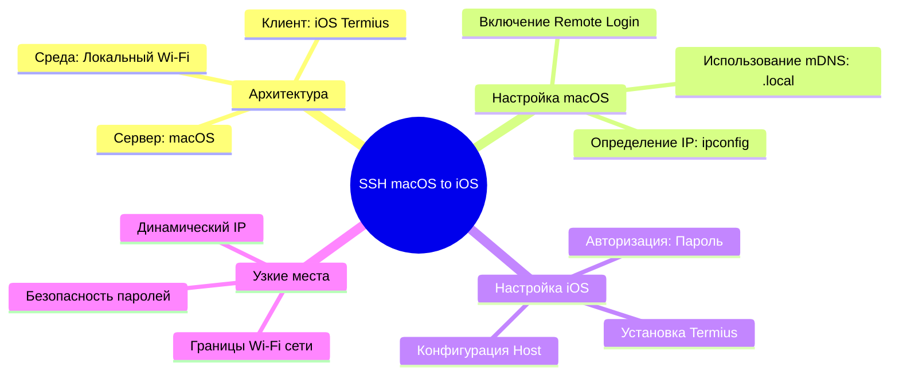

## Локальное SSH-управление macOS с iOS-устройств

### Executive Summary (TL;DR)

Удаленный доступ по протоколу [[SSH]] превращает мобильное устройство в полноценный терминал управления хостом без посредничества внешних облачных сервисов. Главный рычаг — использование локальной сети для прямого выполнения команд на macOS через iOS-клиент, что устраняет необходимость физического доступа к компьютеру. Основным ограничением (bottleneck) является зависимость от стабильности локального IP-адреса и границ Wi-Fi покрытия.

### Core Concept & Feynman Explanation

Представь, что твой Mac — это закрытый охраняемый офис, а iPhone — твой персональный пропуск. Вместо того чтобы лично идти в офис и садиться за рабочий стол, ты отправляешь курьера (протокол [[SSH]]) со специальными инструкциями.

В этой схеме:

- **Mac** выступает в роли **SSH-сервера** — он постоянно "слушает" входящие запросы на порту 22.
- **iPhone** (через приложение Termius) выступает в роли **SSH-клиента** — он шифрует твои команды и отправляет их на Mac.
- **Локальный Wi-Fi** — это защищенный коридор, по которому ходит курьер. Без подключения к этой конкретной сети курьер просто не найдет дорогу к офису.

### Key Takeaways

- Локальный SSH-доступ работает без интернета, обеспечивая максимальную скорость отклика и конфиденциальность данных.
- Использование mDNS-адреса (например, `MacBook-Pro.local`) нивелирует проблему динамического IP, избавляя от необходимости ручной настройки статического адреса.
- Парольная аутентификация — это временное решение; для долгосрочной безопасности и автоматизации критически важно настроить [[Авторизация по SSH-ключам]].
- Главное ограничение локального SSH — радиус действия домашнего Wi-Fi, которое в дальнейшем устраняется интеграцией [[Tailscale]] или VPN.

### Technical Details / Алгоритм настройки

#### Шаг 1. Активация SSH-сервера на macOS

Активируй службу удаленного входа в систему:

1. Перейди в **System Settings → General → Sharing**.
2. Включи тумблер **Remote Login** (Удаленный вход).
3. Запиши предложенный адрес формата `username@MacBook-Pro.local`.

#### Шаг 2. Определение IP-адреса в локальной сети

Если mDNS (`.local`) не разрешается клиентом, определи точный IP-адрес хоста через Терминал:

```bash
# Для беспроводного подключения (Wi-Fi)
ipconfig getifaddr en0

# Для проводного подключения (Ethernet)
ipconfig getifaddr en1
```

#### Шаг 3. Настройка клиента Termius на iOS

1. Установи Termius из App Store.
2. Создай новое подключение (**Add New Host**):
   - **Hostname / IP**: IP-адрес из Шага 2 или имя `MacBook-Pro.local`
   - **Port**: `22` (стандартный порт SSH)
   - **Username**: Имя твоей учетной записи в macOS
   - **Password**: Пароль от твоей учетной записи macOS
3. Сохрани настройки и инициируй подключение.



---

### Reference:

- [Официальное руководство Apple по удаленному управлению через SSH](https://support.apple.com/guide/mac-help/allow-a-remote-computer-to-access-your-mac-mchlp1066/mac)

### Related:

- [[SSH]]
- [[Авторизация по SSH-ключам]]
- [[Tailscale]]
